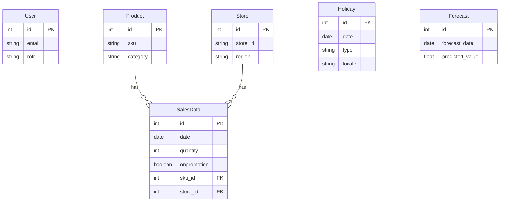

# Database Schema Documentation

This document outlines the database schema for the Inventory Demand Forecasting System (IDFS).

## Models

### 1. User
Represents system users with role-based access control.

| Column | Type | Constraints | Description |
| :--- | :--- | :--- | :--- |
| `id` | Integer | PK, Index | Unique identifier |
| `full_name` | String | Index | User's full name |
| `email` | String | Unique, Index, Not Null | User's email address (username) |
| `hashed_password` | String | Not Null | Securely hashed password |
| `is_active` | Boolean | Default: True | Soft delete / activation status |
| `is_superuser` | Boolean | Default: False | Administrator privilege flag |
| `role` | String | Default: 'analyst' | User role: `admin`, `analyst`, `manager` |

---

### 2. Product
Represents items sold in the inventory.

| Column | Type | Constraints | Description |
| :--- | :--- | :--- | :--- |
| `id` | Integer | PK, Index | Internal unique identifier |
| `sku` | String | Unique, Index, Not Null | Stock Keeping Unit (External ID) |
| `category` | String | Index | Product category family (e.g., 'Groceries') |
| `price` | Float | | Unit price of the product |

**Relationships:**
- `sales`: One-to-Many relationship with `SalesData`.

---

### 3. Store
Represents physical or logical store locations.

| Column | Type | Constraints | Description |
| :--- | :--- | :--- | :--- |
| `id` | Integer | PK, Index | Internal unique identifier |
| `store_id` | String | Unique, Index, Not Null | Store identifier (External ID) |
| `region` | String | Index | Geographic region (e.g., 'Quito') |

**Relationships:**
- `sales`: One-to-Many relationship with `SalesData`.

---

### 4. SalesData
Stores historical sales transactions. This is the core dataset for training models.

| Column | Type | Constraints | Description |
| :--- | :--- | :--- | :--- |
| `id` | Integer | PK, Index | Unique identifier |
| `date` | Date | Index, Not Null | Date of sale |
| `sku_id` | Integer | FK(`product.id`) | Reference to Product |
| `store_id` | Integer | FK(`store.id`) | Reference to Store |
| `quantity` | Integer | Not Null | Units sold |
| `onpromotion` | Boolean | Default: False | Whether the item was on promotion |

**Relationships:**
- `product`: Many-to-One relationship to `Product`.
- `store`: Many-to-One relationship to `Store`.

---

### 5. Holiday
Stores public holidays and events for different locales. Used as a covariate in forecasting models.

| Column | Type | Constraints | Description |
| :--- | :--- | :--- | :--- |
| `id` | Integer | PK, Index | Unique identifier |
| `date` | Date | Index, Not Null | Date of the holiday |
| `type` | String | Index | Type: 'Holiday', 'Event', 'Transfer', etc. |
| `locale` | String | Index | Scope: 'Local', 'Regional', 'National' |
| `locale_name` | String | | Name of the locale (e.g., city name) |
| `description` | String | | Description (e.g., "Christmas") |
| `transferred` | Boolean | Default: False | If the holiday was moved to another day |

---

### 6. Forecast
Stores generated predictions from the ML model.

| Column | Type | Constraints | Description |
| :--- | :--- | :--- | :--- |
| `id` | Integer | PK, Index | Unique identifier |
| `forecast_date` | Date | Index, Not Null | Future date being predicted |
| `predicted_value` | Float | Not Null | Predicted sales quantity (yhat) |
| `lower_bound` | Float | | Lower confidence interval (yhat_lower) |
| `upper_bound` | Float | | Upper confidence interval (yhat_upper) |
| `model_version` | String | Default: "1.0" | Version tag of the model used |
| `created_at` | DateTime | Default: Now() | Timestamp of generation |

## Entity Relationship Diagram (Mermaid)

